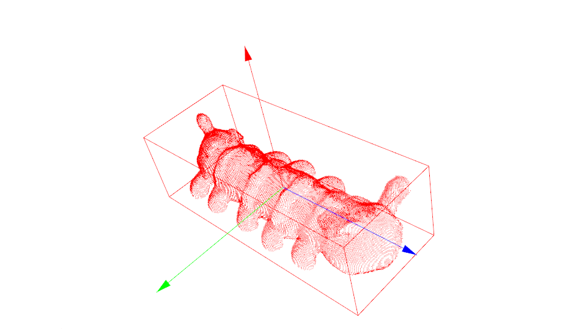
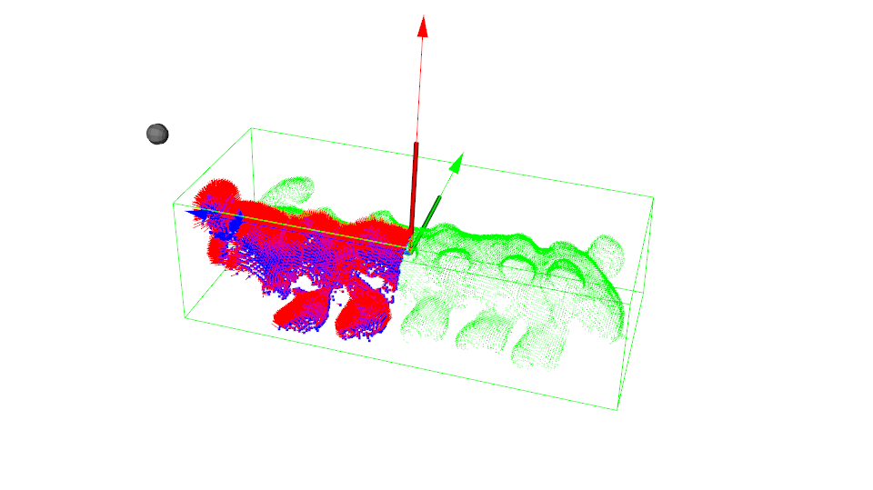

# **grasp_pose_detector_pointnet**

#### 问题汇总：

**1、优化接触点查找**

**2、使用tsdf-fusion获得的mesh文件转换为sdf之后，法线方向不准确**

- [ ] 方案1：直接从tsdf转换为sdf（优先）未找到转换方法，即使转换成功，得到的表面法线依然不准确


- [x] 方案2：舍弃sdf，直接使用点云处理

  	背景：表面点云可直接获取表面点但无法线，重建的mesh有法线但还包含非表面点表

​	面法线获取方法：  ​	

​	**方法1、**直接使用PCL计算表面法线，须设置相机位置，但只设置一个相机无法正确估计各个法线，须使	


  ​		      用多相机位置(分为四块较好)进行法线估计。方案：PCA法计算桌面以上点云的质心，并获得包

  ​		      围盒，以质心为原点， 划分四个象限，每个象限上方放置一相机。

  

  ​	

  ​	**方法2、**将重建的mesh通过pcl转换为点云，此点云包含点及法线信息但包含非表面点，通过表面点云可以获得表面点的坐标，通过kdtree在mesh转换所得点云中查找各表面点附近点的法线即可。经测试，优于方法1。


### Before Install

All the code should be installed in the following directory:
```
mkdir -p $HOME/code/
cd $HOME/code/
```
### Install all the requirements (Using a virtual environment is recommended)
1. Make sure you are  in the Python3 environment.

1. Clone this repository:
    ```bash
    cd $HOME
    git clone https://github.com/MrRen-sdhm/SSGPD
    mv PointNetGPD grasp-pointnet
    ```

1. Install requirements in `requirements.txt`
    ```bash
    cd SSGPD
    pip install -r requirements.txt
    ```

1. Install our modified autolab_core (Modify from [Berkeley Automation Lab: autolab_core](https://github.com/BerkeleyAutomation/autolab_core.git))

    ```
    cd SSGPD/3rdparty/autolab_core
    python setup.py install
    ```

1. Install our modified autolab_perception (Modify from [Berkeley Automation Lab: autolab_perception](https://github.com/BerkeleyAutomation/perception.git))

    ```
    cd SSGPD/3rdparty/autolab_perception
    pip install -e .
    ```

1. Modify the gripper configurations to your own gripper

    ```bash
    gedit SSGPD/Generator/gripper_params.yaml
    ```


### Generate Grasp Dataset

Generate dataset by running the code:

```bash
cd SSGPD/Generator
python dataset_generator.py
```
### Visualization tools

  mlab: https://docs.enthought.com/mayavi/mayavi/mlab.html

- Visualization grasps
    ```bash
    cd $HOME/code/grasp-pointnet/dex-net/apps
    python read_grasps_from_file.py [prefix]
    ```

### Training the network
1. Data prepare:
    ```bash
    cd $HOME/code/grasp-pointnet/PointNetGPD/data
    ```

    Make sure you have the following files, The links to the dataset directory should add by yourself:
    ```
    ├── google2cloud.csv  (Transform from google_ycb model to ycb_rgbd model)
    ├── google2cloud.pkl  (Transform from google_ycb model to ycb_rgbd model)
    ├── ycb_grasp -> $HOME/dataset/ycb_grasp  (Links to the dataset directory)
    ├── ycb_meshes_google -> $HOME/dataset/ycb_meshes_google/objects  (Links to the dataset directory)
    └── ycb_rgbd -> $HOME/dataset/ycb_rgbd  (Links to the dataset directory)
    ```

    Generate point cloud from rgb-d image, you may change the number of process running in parallel if you use a shared host with others
    ```bash
    cd ..
    python ycb_cloud_generate.py
    ```
    Note: Estimated running time at our `Intel(R) Xeon(R) CPU E5-2690 v4 @ 2.60GHz` dual CPU with 56 Threads is 36 hours. Please also remove objects beyond the capacity of the gripper.

1. Run the experiments:
    ```bash
    cd PointNetGPD
    ```

    Launch a tensorboard for monitoring
    ```bash
    tensorboard --logdir ./assets/log --port 8080
    ```

    and run an experiment for 200 epoch
    ```
    python main_1v.py --mode train --epoch 200 --cuda
    ```

    reload pretrained model

    ```
    python main_1v.py --mode train --epoch 200 --cuda --load-model default_120.model --load-epoch 120
    ```

    File name and corresponding experiment:

    ```
    main_1v.py        --- 1-viewed point cloud, 2 class
    main_1v_mc.py     --- 1-viewed point cloud, 3 class
    main_1v_gpd.py    --- 1-viewed point cloud, GPD
    main_fullv.py     --- Full point cloud, 2 class
    main_fullv_mc.py  --- Full point cloud, 3 class
    main_fullv_gpd.py --- Full point cloud, GPD
    ```

    For GPD experiments, you may change the input channel number by modifying `input_chann` in the experiment scripts(only 3 and 12 channels are available)

### Using the trained network (Only work in python2 as we use ROS)

1. Get UR5 robot state:

    Goal of this step is to publish a ROS parameter tell the environment whether the UR5 robot is at home position or not.
    ```
    cd $HOME/code/grasp-pointnet/dex-net/apps
    python get_ur5_robot_state.py
    ```
2. Run perception code:
    This code will take depth camera ROS info as input, and gives a set of good grasp candidates as output.
    All the input, output messages are using ROS messages.
    ```
    cd $HOME/code/grasp-pointnet/dex-net/apps
    python kinect2grasp_python2.py

    arguments:
    -h, --help                 show this help message and exit
    --cuda                     using cuda for get the network result
    --gpu GPU                  set GPU number
    --load-model LOAD_MODEL    set witch model you want to use (rewrite by model_type, do not use this arg)
    --show_final_grasp         show final grasp using mayavi, only for debug, not working on multi processing
    --tray_grasp               not finished grasp type
    --using_mp                 using multi processing to sample grasps
    --model_type MODEL_TYPE    selet a model type from 3 existing models
    ```

### Acknowledgement
- [gpg](https://github.com/atenpas/gpg)
- [gpd](https://github.com/atenpas/gpd)
- [dex-net](https://github.com/BerkeleyAutomation/dex-net)
- [meshpy](https://github.com/BerkeleyAutomation/meshpy)
- [mayavi](https://github.com/enthought/mayavi)

